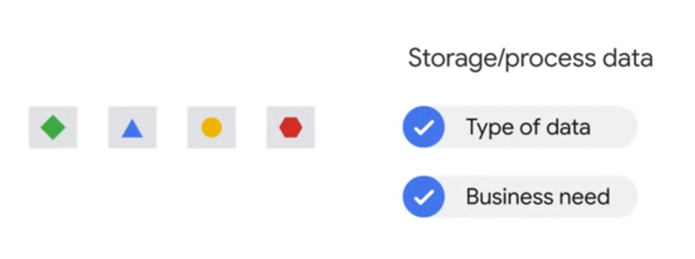
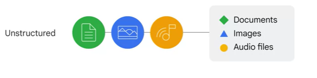
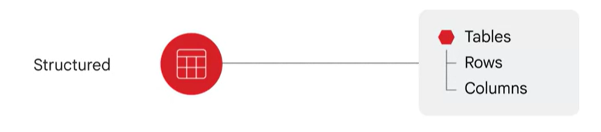

# 1. Big Data and Machine Learning on Google Cloud

This section provides an overview of the Google Cloud infrastructure, focusing on aspects related to Big Data and Machine Learning.

## Google Cloud Infrastructure

Google Cloud's infrastructure is designed to be robust and flexible, catering to a wide range of needs. It consists of several components:

- **Network and Security**: Google Cloud provides advanced networking features, including Virtual Private Cloud (VPC), load balancing, and DNS. It also offers robust security features like Identity and Access Management (IAM) and encryption.

- **Compute**: Google Cloud offers various compute services, from virtual machines in Compute Engine to fully managed application platforms in App Engine.

- **Storage**: Google Cloud provides scalable and durable storage options, including Cloud Storage for object storage, Persistent Disk for block storage, and Cloud SQL for relational database service.

- **Big Data and ML Products**: Google Cloud offers a suite of big data and machine learning products, including BigQuery for data warehousing, Cloud Machine Learning Engine for machine learning, and Dataflow for stream and batch processing.

## Location

Google Cloud services are available in locations across North America, South America, Europe, Asia, and Australia. These locations are divided into regions and zones.

### Regions and Zones

A region is a specific geographical location where you can host your resources. Each region has one or more zones, which are isolated locations within the region.

- **Regions**: For example, London, EU West2, etc.
- **Zones**: For example, EU West2a, EU West2b, etc.

To ensure resource redundancy, you have the possibility to work on many zones and regions. Some services can even run in multiple geo locations, like in the Netherlands and Belgium.

## Computing Services

Google Cloud offers a variety of computing services to cater to different needs. Here's a brief overview of each:

### Compute Engine
Compute Engine is an Infrastructure as a Service (IaaS) offering that provides you with fine-tuned control over your computing environment. It offers flexible compute, storage, and networking options.

### Google Kubernetes Engine (GKE)
GKE allows you to run containerized applications in a cloud environment. It manages the underlying infrastructure, so you can focus on deploying your applications.

### App Engine
App Engine is a Platform as a Service (PaaS) offering that fully manages the underlying infrastructure. You just bind your code to libraries and focus on your application logic.

### Cloud Functions
Cloud Functions is a Functions as a Service (FaaS) offering that executes your code in response to events, such as HTTP requests or changes in data.

### Cloud Run
Cloud Run is a fully managed platform that lets you focus on writing code without worrying about the underlying infrastructure. It automatically scales up and down and charges you only for the resources you use.

### Example: Google Photo Automatic Video Stabilization

Google Photos uses a combination of different technologies to automatically stabilize videos:

- **Video Data**: The video itself is used along with time series data on the camera's position and orientation from the onboard gyroscope, and motion data from the camera's lens.
- **Hardware**: Google uses both GPUs and CPUs for processing. They have also introduced the Tensor Processing Unit (TPU), a domain-specific hardware that allows for higher efficiency.
- **Efficiency**: TPUs are faster and more energy-efficient than traditional processing units, making them ideal for tasks like video stabilization.
 

## Storage Service
Choosing the right option to store and process data often depends on the data type that needs to be stored and the business need.

### Data Types

- **Unstructured data**: Document, images, audio suited to cloud storage and now for BigQuery also

    - 
- **Structured data**

    - 
    
    - Transactional workloads : stem from online
    transaction processing systems, used when fast data insert and update are required. This is usually to maintain a system snapshot, they requires standardized queries that impact only a few records
    - Analytical workload: Stem from online analytical systems used to read the entire datasets. They often require complex queries like aggregations

### Goal of these products is to reduce the time and effort needed to store data 

## Cloud Storage

Cloud Storage is a managed service for storing unstructured data such as documents, images, and audio. Here are some key points:

- **Objects**: You store objects in containers called buckets. An object is an immutable piece of data consisting of a file of any format.
- **Projects and Buckets**: All buckets are associated with a project, and you can group your projects under an organization. Each project, bucket, and object in Google Cloud is a resource, as are things such as Compute Engine instances.
- **Operations**: You can download and upload objects from and to your bucket.
- **Use Cases**: Examples include serving website content, storing data for archival and disaster recovery, and distributing large data objects to end users via direct download.

## Databases

Google Cloud offers various database services to cater to different needs:

- **Cloud SQL**: Works best for local to regional scalability.
- **Cloud Spanner**: Allows you to scale a database globally.
- **Firestore**: A transactional NoSQL, document-oriented database.
- **BigQuery**: Google's data warehouse solution that lets you analyze petabyte-scale datasets.
- **Cloud Bigtable**: Provides a scalable NoSQL solution for analytical workloads. It's best for real-time, high-throughput applications that require only millisecond latency.

## Storage Classes

Google Cloud offers various storage classes to cater to different needs:

- **Standard Storage**: For hot data (frequently accessed) or data stored for only brief periods of time.
- **Nearline Storage**: For infrequently accessed data (once per month), like data backups and archiving.
- **Coldline Storage**: For data accessed once every 90 days.
- **Archive Storage**: For data accessed once a year, suitable for archiving, online backup, and disaster recovery.

